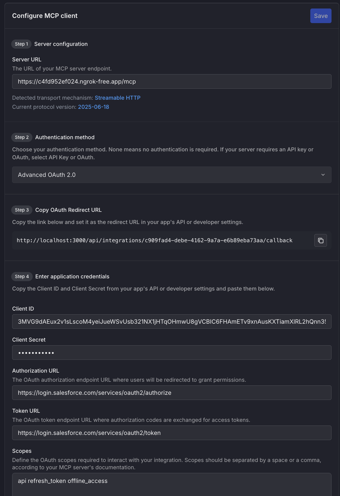
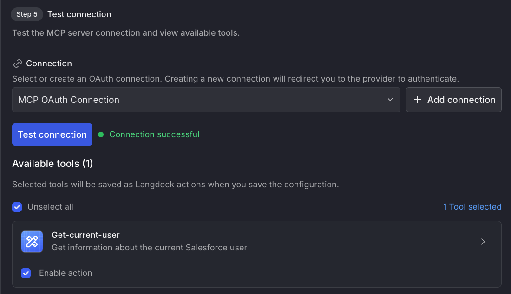

# Salesforce MCP Server

A Model Context Protocol (MCP) server for Salesforce integration with Bearer token forwarding.

## How it Works

This MCP server demonstrates the OAuth Bearer token forwarding pattern:

1. **Langdock** authenticates with Salesforce using your External Client App OAuth configuration
2. **Langdock** receives a Bearer token from Salesforce
3. **Langdock** forwards this Bearer token to your MCP server in the `Authorization` header
4. **Your MCP server** extracts this token and uses it to make authenticated API calls to Salesforce

The server stores the Bearer token per session, allowing it to maintain authenticated connections to Salesforce throughout the MCP session lifecycle.

## Installation / Setup

```bash
pnpm i
```

### Environment Setup

Create a `.env` file in the root directory with your Salesforce configuration:

```bash
# Copy from .env.example
SALESFORCE_INSTANCE_URL=https://your-instance.my.salesforce.com
```

The server uses the Salesforce instance URL from the `SALESFORCE_INSTANCE_URL` environment variable.

### Configuration

The server requires:

- Bearer token in the `Authorization` header (format: `Bearer YOUR_TOKEN`)
- Salesforce instance URL via `SALESFORCE_INSTANCE_URL` environment variable (see Environment Setup above)

### Salesforce setup

1. Enable API Access, go to:  Setup → Profiles → [Your Profile] → System Permissions

   a. Make sure API Enabled is checked. Without this, no external app can reach Salesforce.

2. Add a Connected App. You need to go to Setup → Apps → App Manager (https://your-instance.develop.lightning.force.com/lightning/setup/NavigationMenus/home).

   a. Create a new Connected App

   b. Name your app

   c. Enable OAuth Settings

   d. Set the callbackk url from /mcp on langdock

   e. Add scopes like: full, refresh_token, api

   f. Save your Consumer Key and Consumer Secret

## Connecting with Langdock

### Start the server

```bash
pnpm dev # runs on port 3333
```

### Tunnel using ngrok

```bash
ngrok http 3333
```

### Configure MCP client in Langdock



Then create and test the connection


